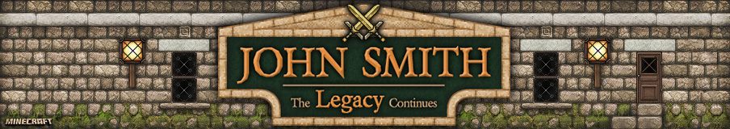

<!--
*** Thanks for checking out this README Template. If you have a suggestion that would
*** make this better, please fork the repo and create a pull request or simply open
*** an issue with the tag "enhancement".
*** Thanks again! Now go create something AMAZING! :D
-->

<!-- PROJECT SHIELDS -->
<!--
*** I'm using markdown "reference style" links for readability.
*** Reference links are enclosed in brackets [ ] instead of parentheses ( ).
*** See the bottom of this document for the declaration of the reference variables
*** for contributors-url, forks-url, etc. This is an optional, concise syntax you may use.
*** https://www.markdownguide.org/basic-syntax/#reference-style-links
-->
[![Contributors][contributors-shield]][contributors-url]
[![Forks][forks-shield]][forks-url]
[![Stargazers][stars-shield]][stars-url]
[![Issues][issues-shield]][issues-url]
[![License: Apache-2.0][license-shield]][license-url]
[![Contributor Covenant][code-of-conduct-shield]][code-of-conduct-url]

<!-- PROJECT LOGO -->
 

  

  <h3 align="center">John Smith Legacy - Modded</h3>

  

    A resource pack for Minecraft v1.16.X.
     
     
    <a href="https://github.com/ScottKillen/JSTR-Modded-1.16.x/issues">Report Bug</a>
    ·
    <a href="https://github.com/ScottKillen/JSTR-Modded-1.16.x/issues">Request Feature</a>
  

<!-- TABLE OF CONTENTS -->
<!-- omit in toc -->
## Table of Contents

- [About The Project](#about-the-project)
- [Contributing](#contributing)
- [License](#license)
- [Contact](#contact)
- [Acknowledgements](#acknowledgements)

<!-- ABOUT THE PROJECT -->
## About The Project

This is a port of [John Smith Technician's Remix](https://www.curseforge.com/minecraft/texture-packs/john-smith-legacy-modded)
to Minecraft v1.16.X.

John Smith Technician's Remix is a variation of the original John Smith texture
pack which is designed for use with modded Minecraft, such as the FTB modpacks,
Tekkit and Tekkit Lite.

<!-- CONTRIBUTING -->
## Contributing

For additional information, see [CONTRIBUTING.md][contributing-url] for details.

<!-- LICENSE -->
## License

Copyright 2022 Scott D. Killen

A derivative of [John Smith Legaxy - Modded](https://www.curseforge.com/minecraft/texture-packs/john-smith-legacy-modded)

   Licensed under the Apache License, Version 2.0 (the "License");
   you may not use this file except in compliance with the License.
   You may obtain a copy of the License at

       http://www.apache.org/licenses/LICENSE-2.0

   Unless required by applicable law or agreed to in writing, software
   distributed under the License is distributed on an "AS IS" BASIS,
   WITHOUT WARRANTIES OR CONDITIONS OF ANY KIND, either express or implied.
   See the License for the specific language governing permissions and
   limitations under the License.

<!-- CONTACT -->
## Contact

Your Name - [@ScottKillen](https://twitter.com/scottkillen) - scott@scottkillen.com

Project Link: [https://github.com/ScottKillen/JSTR-Modded-1.16.x](https://github.com/ScottKillen/JSTR-Modded-1.16.x)

<!-- ACKNOWLEDGEMENTS -->
## Acknowledgements

- [John Smith Legacy - Modded](https://www.curseforge.com/minecraft/texture-packs/john-smith-legacy-modded)
- [John-Smith-Modded](https://github.com/John-Smith-Modded?type=source)

<!-- MARKDOWN LINKS & IMAGES -->
<!-- https://www.markdownguide.org/basic-syntax/#reference-style-links -->
[contributors-shield]: https://img.shields.io/github/contributors/ScottKillen/JSTR-Modded-1.16.x.svg?style=flat-square
[contributors-url]: https://github.com/ScottKillen/JSTR-Modded-1.16.x/graphs/contributors
[forks-shield]: https://img.shields.io/github/forks/ScottKillen/JSTR-Modded-1.16.x.svg?style=flat-square
[forks-url]: https://github.com/ScottKillen/JSTR-Modded-1.16.x/network/members
[stars-shield]: https://img.shields.io/github/stars/ScottKillen/JSTR-Modded-1.16.x.svg?style=flat-square
[stars-url]: https://github.com/ScottKillen/JSTR-Modded-1.16.x/stargazers
[issues-shield]: https://img.shields.io/github/issues/ScottKillen/JSTR-Modded-1.16.x.svg?style=flat-square
[issues-url]: https://github.com/ScottKillen/JSTR-Modded-1.16.x/issues
[license-shield]: https://img.shields.io/hexpm/l/apa
[license-url]: https://github.com/ScottKillen/JSTR-Modded-1.16.x/blob/master/LICENSE.md
[code-of-conduct-shield]: https://img.shields.io/badge/Contributor%20Covenant-v2.0%20adopted-ff69b4.svg?style=flat-square
[code-of-conduct-url]: https://github.com/ScottKillen/JSTR-Modded-1.16.x/blob/master/CODE_OF_CONDUCT.md
[contributing-url]: https://github.com/ScottKillen/JSTR-Modded-1.16.x/blob/master/CONTRIBUTING.md
